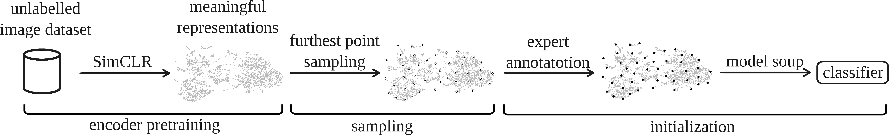

# inital-data-point-selection

Codebase for the *A Data-Driven Solution for the Cold Start Problem in Biomedical Image Classification* paper submitted to ISBI 2024.



## Structure

- ```src/``` contains all the reusable source code.
    - ```src/datasets/data/``` contains all the image datasets with a ```train/```, ```val/```, and ```test/``` subfolders.
    - ```src/models/data/``` contains all the registered models, precomputed features, and metadata.
- ```tasks/``` are all the scripts that use the source code to generate results saved in ```outputs/```.
- [Hydra](https://hydra.cc/) is used for configurations, which are saved in ```conf/```.
- [Weights & Biases](https://wandb.ai/site) is used for tracking runs and as a storage of results.

## Set-up

The code has been tested to work well with Python 3.10.12.

1. ```pip install -r requirements.txt```
2. Put your Weights & Biases [API key](https://wandb.ai/authorize) in ```config.ini```.
3. Run ```python -m tasks.datasets.download -d matek -d isic -d retinopathy -d jurkat``` to download all the used datasets.

## Encoder Pretraining

To train [SimCLR](https://arxiv.org/abs/2002.05709) for the ```matek``` dataset run:
```
python -m tasks.training.train_simclr dataset=matek
```
\
To train [SwAV](https://arxiv.org/pdf/2006.09882.pdf) for the ```matek``` dataset run:
```
python -m tasks.training.train_swav dataset=matek
```
\
To train [DINO](https://arxiv.org/pdf/2104.14294.pdf) for the ```matek``` dataset run:
```
python -m tasks.training.train_dino dataset=matek
```
\
To register model's weights after training run the following:
```
python -m tasks.backups.add_new_model \
    --path=[path to model weights in lightning_logs/] \
    --type=[simclr/swav/dino] \
    --version=[v1/v2/...] \
    --dataset=[dataset name]
```

## Feature Extraction & Precomputation

To extract features from a self-supervised model run the following:
```
python -m tasks.inference.extract_features \
    dataset=[dataset name] \
    training.weights.type=[simclr/swav/dino] \
    training.weights.version=[v1/v2/...]
```
\
To precompute features from a self-supervised model with a number of random augmentations for each image run the following:
```
python -m tasks.inference.precompute_features \
    dataset=[dataset name] \
    training.weights.type=[simclr/swav/dino] \
    training.weights.version=[v1/v2/...] \
    num_augmentations=[number of random augmentations for each image]
```
This allows us to save a lot of computation time in the Classifier Training step, since we freeze the weights of the encoder and train only the classifier head.


## Classifier Training
To train the classifier head(s) and aggregate them into a final model using [Model Soups](https://arxiv.org/pdf/2203.05482.pdf) run the following:
```
python -m tasks.training.linear_classifier \
    dataset=[dataset name] \
    training.weights.type=[simclr/swav/dino] \
    training.weights.version=[v1/v2/...] \
    training.learning_rate=null
```
Feel free to tinker with the ```features```, ```kmeans```, and ```soup``` configurations.

To train the classifier head using all of the annotated data with proper hyperparameter selection using validation set run the following:
```
python -m tasks.training.linear_classifier_ceiling \
    dataset=[dataset name] \
    training.weights.type=[simclr/swav/dino] \
    training.weights.version=[v1/v2/...] \
    training.learning_rate=null \
    training.train_samples=null
```


## Visualisations
Check the ```tasks/vis/``` for all the scripts to visualise the results.


